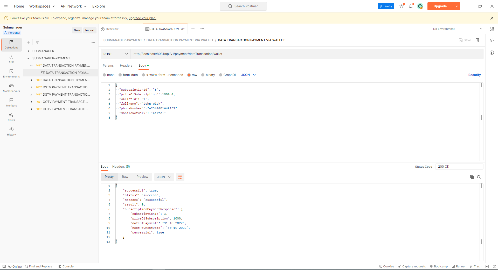
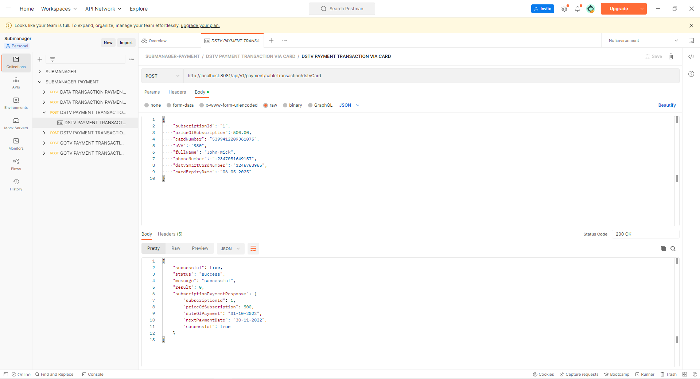
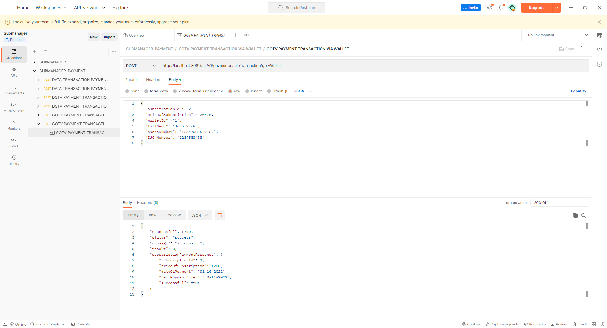

# submanager-payment
A demo payment platform for submanager to help mock the behavior of a subscription platform. It was created using spring-boot using Maven as dependency tool and MySql as database.

# POST-MAN DOCUMENTATION
https://documenter.getpostman.com/view/21596187/2s8YRjoD7Q

# TO RUN PROJECT
$ mvn spring-boot:run

# TO RUN TEST
$ mvn test

# CONFIGURATIONS
Open the application.properties file and set your own configurations for the MySql database connection.

